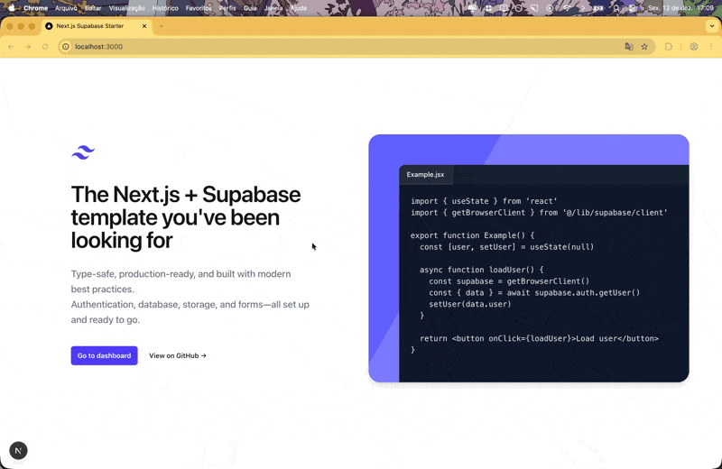
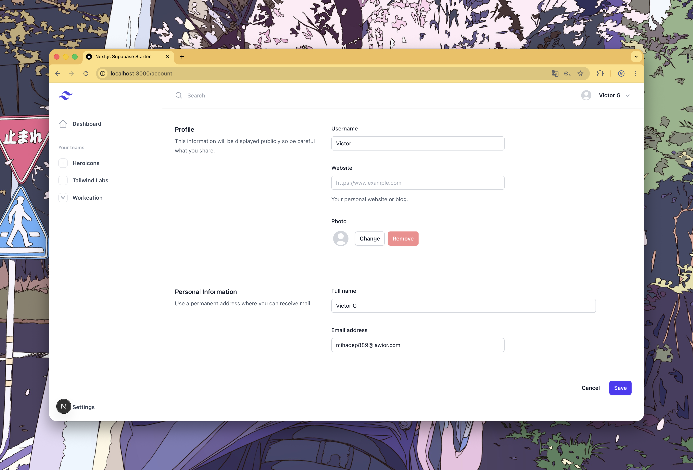

# Next.js + Supabase Template ✨

Production-ready full-stack template combining Next.js 16 with Supabase. Includes server-side authentication, optimized image uploads, type-safe forms with validation, and a scalable architecture with clear client/server separation.

[](https://nextjs.org/)
[](https://supabase.com/)
[](https://www.typescriptlang.org/)
[](https://tailwindcss.com/)

[Demo](https://next-supabase-template-zeta.vercel.app/) • [Documentation](docs/inicio.md) • [Report Bug](https://github.com/vctorgriggi/next-supabase-template/issues)

> 🇧🇷 **Portuguese Documentation:** All technical documentation is available in Portuguese at [docs/](docs/)



---

## ✨ Features

🔐 **Complete Authentication** — Email/password auth with confirmation and automatic refresh  
👤 **User Profiles** — Profile management with avatar upload and validation  
📁 **Optimized Storage** — Upload with automatic compression and real-time preview  
📝 **Smart Forms** — React Hook Form + Zod with client and server validation  
🔄 **Efficient Cache** — TanStack Query with SSR and automatic invalidation  
🛡️ **Type-Safe** — Full TypeScript support with inferred types  
🚀 **Server Actions** — Secure mutations without API routes  
🎯 **Error Handling** — Consistent Result<T> pattern  
🎨 **Modern UI** — Tailwind CSS 4 + Headless UI components  
📱 **Responsive** — Mobile-first optimized design



---

## 🚀 Quick Start

```bash
# Clone the repository
git clone https://github.com/vctorgriggi/next-supabase-template.git
cd next-supabase-template

# Install dependencies
npm install

# Set up environment variables
cp .env.example .env.local
# Edit .env.local with your Supabase credentials

# Set up the database (see docs/configuracao-supabase.md)
# Run the SQL scripts in Supabase SQL Editor

# Run the project
npm run dev
```

Open [http://localhost:3000](http://localhost:3000) 🎉

> **📖 Detailed guide:** [Getting started documentation](docs/inicio.md)

---

## 📚 Documentation

**🎯 Essential**

- [Getting Started](docs/inicio.md)
- [Architecture](docs/arquitetura.md)
- [Supabase Setup](docs/configuracao-supabase.md)

**🔧 Features**

- [Authentication](docs/autenticacao.md)
- [Forms](docs/formularios.md)
- [File Uploads](docs/upload-arquivos.md)

---

## 🏗️ Project Structure

```
├── app/                      # Next.js App Router
│   ├── (public)/            # Public routes (login, register)
│   └── (private)/           # Protected routes (dashboard, account)
├── components/              # React components
│   ├── ui/                  # Reusable UI components
│   ├── auth/                # Auth-related components
│   └── dashboard/           # Dashboard components
├── hooks/                   # Custom React hooks
├── lib/                     # Utility functions
│   ├── actions/             # Server Actions
│   ├── supabase/            # Supabase clients and helpers
│   ├── validators/          # Zod schemas
│   └── types/               # TypeScript types
└── public/                  # Static assets
```

---

## 🛠️ Tech Stack

**Framework** → [Next.js 16](https://nextjs.org/) (App Router)  
**Backend** → [Supabase](https://supabase.com/) (Auth • Database • Storage)  
**Styling** → [Tailwind CSS 4](https://tailwindcss.com/)  
**UI Components** → [Headless UI](https://headlessui.com/)  
**Forms** → [React Hook Form](https://react-hook-form.com/) + [Zod](https://zod.dev/)  
**State** → [TanStack Query](https://tanstack.com/query)  
**Language** → [TypeScript](https://www.typescriptlang.org/)

---

## 📝 Code Patterns

### Error Handling with Result<T>

```typescript
type Result<T> = { success: true; data: T } | { success: false; error: string };

// Usage
const result = await updateProfile(data);
if (!result.success) {
  notifyError(result.error);
  return;
}
```

### Type-Safe Server Actions

```typescript
'use server';

export async function updateProfile(
  updates: ProfileUpdate,
): Promise<Result<boolean>> {
  const user = await requireAuth();
  // ... server-side logic
}
```

### Route Protection

```typescript
// Server Component
const user = await requireAuth(); // redirects if not logged in
const user = await getCurrentUser(); // returns null
```

---

## 🚀 Deploy

[](https://vercel.com/new/clone?repository-url=https://github.com/vctorgriggi/next-supabase-template)

---

## 🙏 Credits

Based on the [official Supabase tutorial](https://supabase.com/docs/guides/getting-started/tutorials/with-nextjs) with significant improvements:

✅ Server/client separation  
✅ Server Actions + Result<T>  
✅ Reusable custom hooks  
✅ Optimized RLS policies  
✅ Public storage with CDN  
✅ Image compression  
✅ Complete Zod validation

---

**[Issues](https://github.com/vctorgriggi/next-supabase-template/issues)** • **[Discussions](https://github.com/vctorgriggi/next-supabase-template/discussions)** • **[License](LICENSE)**

Made with ❤️ by [vctorgriggi](https://github.com/vctorgriggi)
