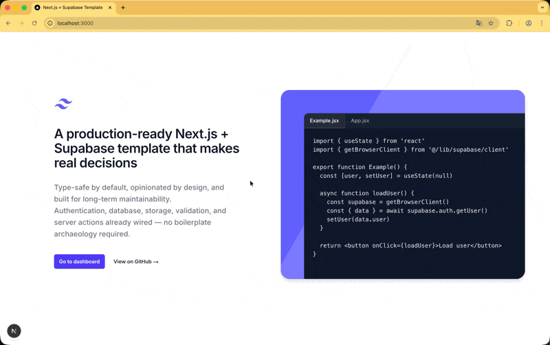

# Next.js + Supabase Template 🚀

A production-ready starter for Next.js apps using Supabase, focused on type safety, security and long-term maintainability.

This is **not** a minimal starter. It's the setup I kept rebuilding across real projects until I got tired of it.

[](https://nextjs.org/)
[](https://www.typescriptlang.org/)
[](https://supabase.com/)
[](https://tailwindcss.com/)
[](https://zod.dev/)

---

## ✨ Features

🔐 **Full Authentication** — Login, register, email confirmation  
🛡️ **Protected Routes** — App Router layouts with SSR  
👤 **User Profiles** — Complete profile management system  
📸 **Avatar Upload** — Client-side compression + Supabase Storage  
🔒 **RLS Policies** — Database-level security  
✅ **Type Safety** — TypeScript + Zod end-to-end  
⚡ **Server Actions** — No API routes needed  
🔄 **SSR + Prefetch** — TanStack Query integration

---

## 📸 Screenshots

> A quick look at the app structure and main flows.

<p align="center">
  
</p>

<p align="center">
  
  
</p>

> Screenshots are from the demo app included in this repository.

---

## 🚀 Quick Start

```bash
# Clone the repository
git clone https://github.com/vctorgriggi/next-supabase-template.git
cd next-supabase-template

# Install dependencies
npm install

# Setup environment
cp .env.example .env.local

# Run the project
npm run dev
```

Open [http://localhost:3000](http://localhost:3000) 🎉

---

## 🏗️ Architectural Decisions

This template makes **strong, explicit choices**:

✅ **Server Actions** instead of API routes  
✅ **Double validation** (client for UX, server for security)  
✅ **3-layer database access** (separation of concerns)  
✅ **`Result<T>` pattern** instead of throwing errors  
✅ **Direct Storage uploads** (bypass Next.js for files)

These decisions are intentional and documented.

→ Read the full architecture: [`docs/concepts.md`](docs/concepts.md)

---

## 📚 Documentation

The documentation is structured to be read progressively:

**Getting Started**  
→ [`docs/quick-start.md`](docs/quick-start.md)  
→ [`docs/supabase-setup.md`](docs/supabase-setup.md)

**Core Concepts & Architecture**  
→ [`docs/concepts.md`](docs/concepts.md)  
→ [`docs/structure.md`](docs/structure.md)

**Features**  
→ Authentication — [`docs/features/authentication.md`](docs/features/authentication.md)  
→ User Profile & Avatar — [`docs/features/profile.md`](docs/features/profile.md)  
→ Forms & Validation — [`docs/features/forms.md`](docs/features/forms.md)

---

## 🛠️ Tech Stack

**Framework** → [Next.js 15](https://nextjs.org/) (App Router)  
**Backend** → [Supabase](https://supabase.com/) (Auth, Database, Storage)  
**Styling** → [Tailwind CSS 4](https://tailwindcss.com/)  
**Validation** → [Zod](https://zod.dev/)  
**Data Fetching** → [TanStack Query](https://tanstack.com/query)  
**Language** → [TypeScript](https://www.typescriptlang.org/)

---

## ⚠️ When NOT to Use This

This template is probably **not** a good fit if:

❌ You want the smallest possible starter  
❌ You're building a throwaway prototype  
❌ You're not comfortable with TypeScript  
❌ You strongly prefer REST API routes

This project favors **clarity, safety and scalability** over minimalism.

---

## 🎯 Demo

Live demo: **[https://next-supabase-template-zeta.vercel.app](https://next-supabase-template-zeta.vercel.app/)**

---

## 🤝 Contributing

Contributions are welcome! Open an issue or submit a PR.

---

## 📜 Project Status

This template is actively used and evolved. Breaking changes may happen as patterns improve.

---

## 📄 License

MIT

---

**[Issues](https://github.com/vctorgriggi/next-supabase-template/issues)**

Made with ❤️ by [vctorgriggi](https://github.com/vctorgriggi)
